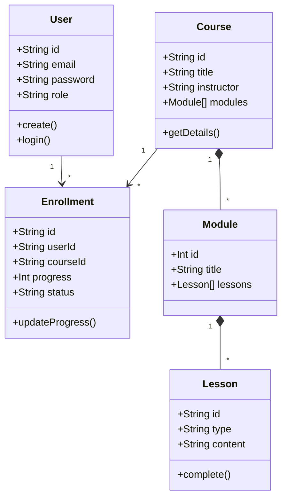
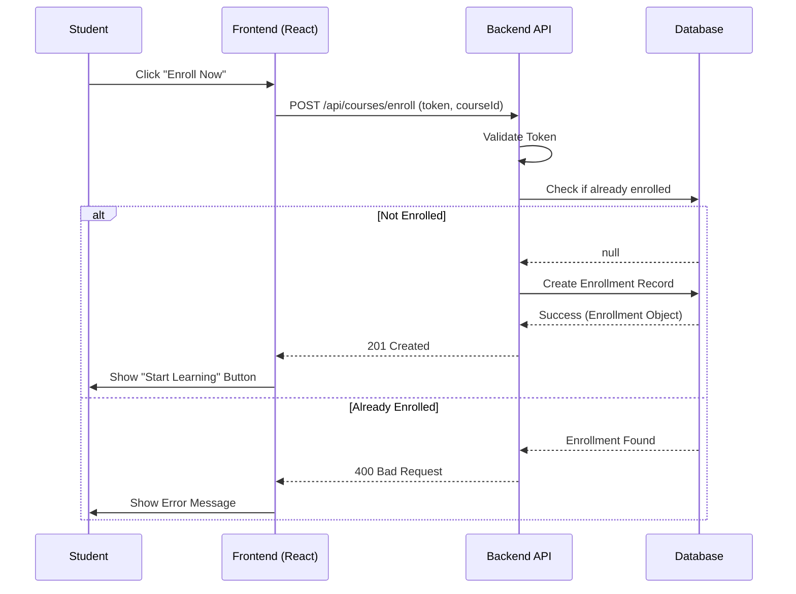

# System Diagrams

## 1. Use Case Diagram

```mermaid
usecaseDiagram
    actor Student
    actor Instructor
    actor Admin

    package "Novara LMS" {
        usecase "Sign Up / Login" as UC1
        usecase "Browse Courses" as UC2
        usecase "Enroll in Course" as UC3
        usecase "Watch Lesson" as UC4
        usecase "Take Quiz" as UC5
        usecase "View Progress" as UC6
        usecase "Manage Courses" as UC7
        usecase "View Analytics" as UC8
    }

    Student --> UC1
    Student --> UC2
    Student --> UC3
    Student --> UC4
    Student --> UC5
    Student --> UC6

    Instructor --> UC1
    Instructor --> UC7
    Instructor --> UC8

    Admin --> UC1
    Admin --> UC7
    Admin --> UC8
```

## 2. Class Diagram (Backend Schema)



## 3. Sequence Diagram (Course Enrollment)


